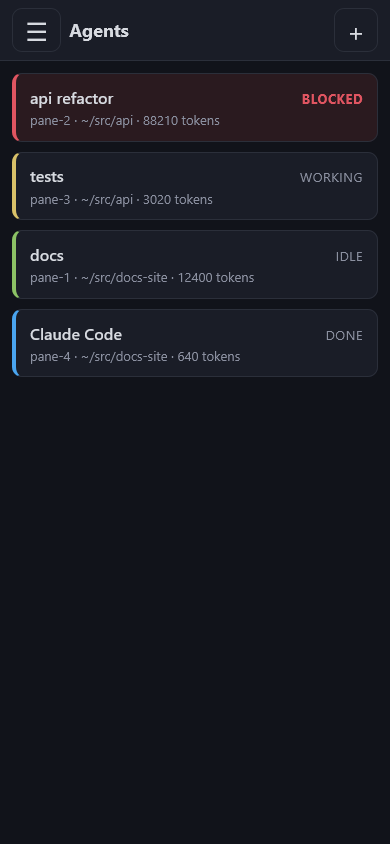
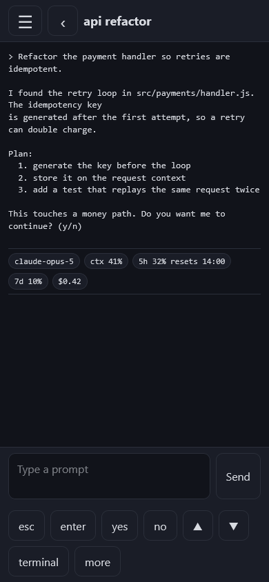
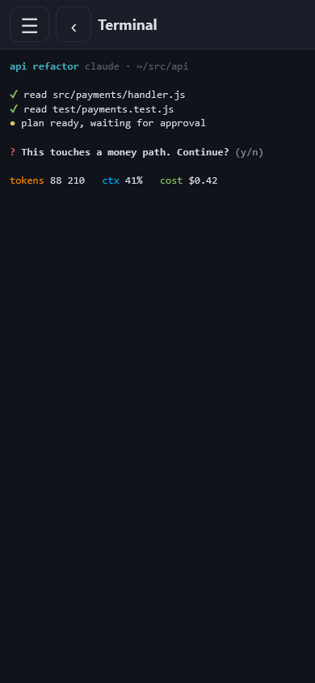
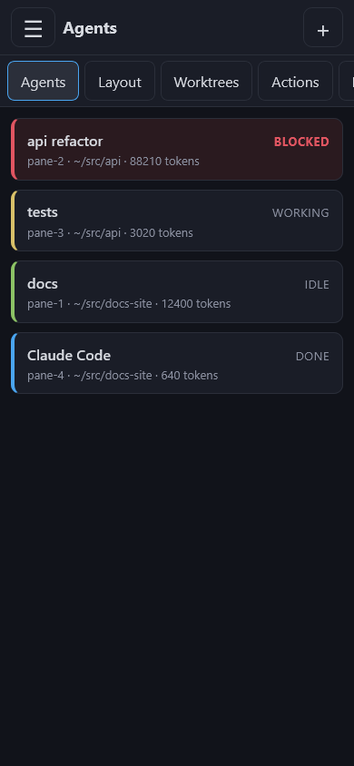
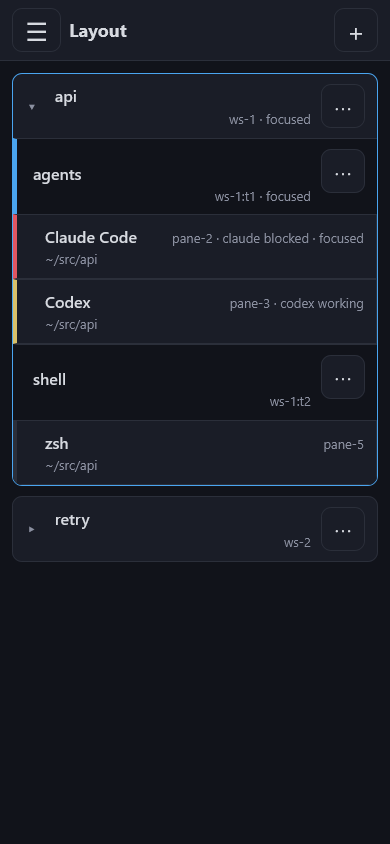

# herdr-phone

A phone-sized web view of the [Herdr](https://herdr.dev) session running on your desktop.
See which agents are blocked, read what they said, answer them, start new agents, rearrange
the layout, and run plugin actions. Add it to your home screen and it behaves like an app.

It is one Node process with no dependencies. It shells out to the `herdr` CLI that is
already on the machine, so it never talks to the Herdr server socket directly and never
needs an API key.

    

## What it can do

- List every agent in the session, blocked ones first, with status, working directory and tokens.
- Show an agent's recent output and send it a prompt.
- Start an agent: pick a name, a kind, and the pane to split for it.
- See the whole layout, workspaces down to panes, with focus and agent status on each node.
- Create and close workspaces, tabs and panes. Split right or down, zoom, rename, move a pane
  to a new tab or workspace, swap two panes, resize.
- Run a command in a pane, or send it raw text or a single key.
- Create, open, focus and remove worktrees.
- List plugin actions and run one.
- Send a desktop notification.

It does not manage the Herdr server itself: no start, stop, update, channel switch or
integration install. Use the desktop for that.

## Read this before you expose it

Anyone who has the token can type into your agents. An agent will happily run a shell
command it is asked to run, so the token is the same thing as a shell on your machine. It can
also run a command in a pane directly, with no agent involved, so that stays true even when
nothing is listening.

- Keep the app inside your tailnet, or on the LAN behind something you trust. Never put it
  on the public internet. **Do not use Tailscale Funnel with it.** `tailscale serve` keeps
  it on the tailnet, Funnel opens it to the world.
- The token is a password. Do not paste it into chat, screenshots or scripts.
- Wrong passwords are throttled. Three in a row from the same source are free, after that the
  source is refused for a wait that doubles from two seconds up to five minutes. The right
  password clears it at once. The wait is capped rather than being a lock, so nobody can shut
  you out of your own app by failing on purpose.
- The app only binds to `127.0.0.1` unless you tell it otherwise. If you set `HOST` to
  anything else it prints a warning, and you should have a reason.

## Requirements

- Herdr 0.8 or later, running, with `herdr` on your `PATH` (or set `HERDR_BIN`). The app
  was written against protocol 20 and refuses to start against another version until you
  say so with `HERDR_PROTOCOL`.
- Node 22 or later.

## Run it

```sh
git clone https://github.com/georgedakoul/herdr-phone.git
cd herdr-phone
npm start
```

It checks that Herdr is running, then prints the address and a token:

```
herdr-phone: herdr 0.8.2, protocol 20
herdr-phone: open http://127.0.0.1:8787/login
herdr-phone: token (generated for this run, not saved anywhere): ...
```

Open the address, paste the token, and you are in. A generated token changes every start.
Set `HERDR_PHONE_TOKEN` to keep the same one.

### Settings

All settings are environment variables. There is no config file.

| Variable | Default | Meaning |
| --- | --- | --- |
| `HERDR_PHONE_TOKEN` | generated per run | The token the login page asks for. |
| `HERDR_BIN` | `herdr` | Path to the herdr CLI. |
| `HERDR_PROTOCOL` | `20` | Protocol version to accept. Only change it to try a newer Herdr. |
| `HOST` | `127.0.0.1` | Address to bind. Anything else prints a warning. |
| `PORT` | `8787` | Port to bind. |
| `HERDR_PHONE_SMTP_USER` | unset | Mail account the alerts are sent from. Alerts are off until this and the password are both set. |
| `HERDR_PHONE_SMTP_PASS` | unset | App password for that account. Not your normal password. |
| `HERDR_PHONE_ALERT_TO` | the SMTP user | Where alerts land. |
| `HERDR_PHONE_SMTP_HOST` | `smtp.gmail.com` | SMTP server, implicit TLS. |
| `HERDR_PHONE_SMTP_PORT` | `465` | SMTP port. |

With the two SMTP variables set, the app sends one mail when a source first hits the wait, and
one more if that source later signs in successfully. Mail that fails is logged to stderr and
never delays or blocks a login.

## Reach it from your phone with Tailscale

Both devices join the same tailnet. On the desktop:

```sh
tailscale serve --bg 8787
tailscale serve status
```

Tailscale terminates HTTPS on the desktop and forwards to the app on loopback, so the app
keeps its loopback bind and the cookie gets the `Secure` flag from the forwarded headers.
The address is the machine's MagicDNS name, for example
`https://desktop.tail1234.ts.net`. Open it on the phone, sign in, then use "Add to Home
Screen" in Safari or Chrome. It opens full screen without browser chrome after that.

To take it down again:

```sh
tailscale serve reset
```

## Run it as a service

`deploy/herdr-phone.service` is a systemd user unit. It expects the checkout at
`~/herdr-phone` and reads settings from `~/.config/herdr-phone/env`.

```sh
mkdir -p ~/.config/herdr-phone ~/.config/systemd/user
printf 'HERDR_PHONE_TOKEN=%s\n' "$(head -c 24 /dev/urandom | base64 | tr '+/' '-_')" > ~/.config/herdr-phone/env
chmod 600 ~/.config/herdr-phone/env
cp deploy/herdr-phone.service ~/.config/systemd/user/
systemctl --user daemon-reload
systemctl --user enable --now herdr-phone
journalctl --user -u herdr-phone -f
```

If Herdr is not running when the service starts, the app exits and systemd retries every
thirty seconds until it is. If `node` or `herdr` live somewhere systemd does not look, such
as an nvm directory, put their full paths in the env file as `HERDR_BIN` and edit
`ExecStart`.

## Develop

```sh
npm test          # node --test, no framework
npm run fixture   # the app over canned data at http://127.0.0.1:8788, token "fixture"
```

The fixture server is how the screenshots above were made, at 390 by 844 pixels. It never
touches Herdr.

The layout is small on purpose: `src/valid.js` checks input, `src/herdr.js` runs the CLI
and unwraps its JSON envelope, `src/ansi.js` turns terminal colour into HTML, `src/app.js`
is the HTTP handler, `src/index.js` starts it, and `public/` is the page.

## License

MIT, see `LICENSE`.
